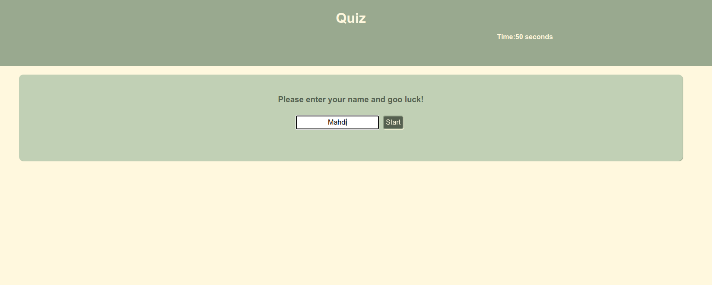

# Code Quiz

## Description

- It is one of the needs for developers to test their knowledge at some point

- Helping the developers to practice their skills and be prepared for the interview

- A web application that takes quizzes in a user-friendly environment on the web

- Javascript, CSS, HTML

## Table of Contents

- [How To Use](#how-to-use)
- [Installation](#installation)
- [Acceptance_Criteria](#acceptance-criteria)
- [Helpful Heroku Resources](#helpful-heroku-resources)
- [Database Strcuture](#database)
- [How to Contribute](#how-to-contribute)

## How To Use

[Link to the website, deploy on GitHub](https://miladesmailpour.github.io/quiz-code/)



## Installation

config the database ans seeding it

```
mysql:
source db/schema.sql
source db/seeds.sql
node:
npm install
node index.js
```

## User Story

```md
AS A business owner
I WANT to be able to view and manage the departments, roles, and employees in my company
SO THAT I can organize and plan my business
```

## Acceptance Criteria

```md
GIVEN a command-line application that accepts user input
WHEN I start the application
THEN I am presented with the following options: view all departments, view all roles, view all employees, add a department, add a role, add an employee, and update an employee role
WHEN I choose to view all departments
THEN I am presented with a formatted table showing department names and department ids
WHEN I choose to view all roles
THEN I am presented with the job title, role id, the department that role belongs to, and the salary for that role
WHEN I choose to view all employees
THEN I am presented with a formatted table showing employee data, including employee ids, first names, last names, job titles, departments, salaries, and managers that the employees report to
WHEN I choose to add a department
THEN I am prompted to enter the name of the department and that department is added to the database
WHEN I choose to add a role
THEN I am prompted to enter the name, salary, and department for the role and that role is added to the database
WHEN I choose to add an employee
THEN I am prompted to enter the employee’s first name, last name, role, and manager, and that employee is added to the database
WHEN I choose to update an employee role
THEN I am prompted to select an employee to update and their new role and this information is updated in the database
```

## Helpful Heroku Resources

[npm documentation on MySQL2](https://www.npmjs.com/package/mysql2)

[npm documentation on Dotenv](https://www.npmjs.com/package/dotenv)

[npm documentation on Inquirer](https://www.npmjs.com/package/inquirer)

## Database

- `department`

  - `id`: `INT PRIMARY KEY`

  - `name`: `VARCHAR(30)` to hold department name

- `role`

  - `id`: `INT PRIMARY KEY`

  - `title`: `VARCHAR(30)` to hold role title

  - `salary`: `DECIMAL` to hold role salary

  - `department_id`: `INT` to hold reference to department role belongs to

- `employee`

  - `id`: `INT PRIMARY KEY`

  - `first_name`: `VARCHAR(30)` to hold employee first name

  - `last_name`: `VARCHAR(30)` to hold employee last name

  - `role_id`: `INT` to hold reference to employee role

  - `manager_id`: `INT` to hold reference to another employee that is the manager of the current employee (`null` if the employee has no manager)

## How to Contribute

Challenges repository
This is an open source project which has Licensed by MIT which allow you to contribute and used open source codes used in this repo (All Branches).
More info: https://g.co/kgs/QWcHhF

- Branches are named as module[n] and each one of them its unique challenge.
- Master Branch contain the last solved challenge. (the read me your are reading trough, it is a defult guid when NO challage availabel to help you do a pre-setup.)

# how to use the module and deploy

- Clone the repo and make it own

  # Https url :

        git clone https://github.com/miladesmailpour/challanges.git

  # ssh url :

        git clone git@github.com:miladesmailpour/challanges.git

  # Checking the fetch/pull and push url :

        git remote -v

  # Modifing origin url :

        git remote add origin [https/ssh url of you repo] https://docs.github.com/en/get-started/quickstart/create-a-repo

  # Verifing the fetch/pull and push url :

        git remote -v https://docs.github.com/en/get-started/getting-started-with-git/managing-remote-repositories

  # Chacking the status of local :

        git status

        "if local NOT updated"
        git add .
        git commit -m "[your comment]"
        git push origin master/main

- Checkout to the module (the challenge you want to used and deploy)
  # Checkout to the disred challage :
       git checkout module[n]
  # Verifing :
       git status
  # [Make the change you wish to have]
       What do you think needed to improve?
  # Commiting to local and updating the GitHub repo:
         git add .
         git commit -m "[your comment]"
         git push origin [your module name]
- Moving Modules to Master Branch and deploy :
  # Creating a pull request to update the master/main :
       https://docs.github.com/en/pull-requests/collaborating-with-pull-requests/proposing-changes-to-your-work-with-pull-requests/creating-a-pull-request
  # Deploy through the GitHub :
       https://docs.github.com/en/pages/getting-started-with-github-pages/configuring-a-publishing-source-for-your-github-pages-site
